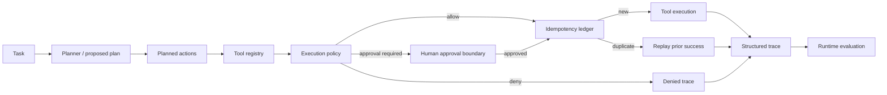

# Agentic AI Workbench

[](https://github.com/cagataykavas/agentic-ai-workbench/actions/workflows/ci.yml)

An inspectable workbench for **tool-using AI workflows with explicit execution authority**. The project separates planning from execution and makes tool risk, approvals, idempotency, bounded steps, traces and evaluation visible in ordinary Python rather than hiding them inside an agent framework.

This repository complements the more specialized [Agentic Migrator](https://github.com/cagataykavas/agentic-migrator): the Migrator is a code-migration product; this workbench is a compact reference implementation for general agent runtime patterns.

## Core design



The important boundary is simple:

> A planner may propose an action. The runtime independently decides whether that action is authorized to execute.

That prevents “the model chose a tool” from silently becoming “the model had permission to cause the side effect.”

## Implemented runtime patterns

### Explicit tool contracts

A `ToolSpec` records:

- name and description;
- Python handler;
- optional argument validator;
- risk level: low / medium / high;
- side-effect class: none / reversible / irreversible;
- whether successful calls are safe to replay from an idempotency ledger.

### Policy before execution

`ToolPolicy` can:

- deny named tools;
- require approval for high-risk actions;
- require approval for irreversible side effects;
- optionally require approval for medium-risk or reversible operations.

The planner does not get to override this policy.

### Human approval boundary

Actions that require review enter `awaiting_approval` rather than being executed optimistically. A later runtime call can include the explicit approved action IDs.

This keeps a human-in-the-loop workflow concrete: approval is represented as execution state, not as a README sentence.

### Idempotent retries

Successful idempotent calls are stored using an explicit or deterministic SHA-256 idempotency key. Repeated requests return `replayed` with the previous output instead of repeating the side effect.

This is useful for agent systems because transport retries, duplicated messages and repeated model plans should not automatically duplicate downstream writes.

### Bounded execution

Every runtime has a `max_steps` budget. Planned actions beyond the budget are surfaced as `skipped_budget` in the trace instead of disappearing.

### Structured traces

Every action records:

```text
action ID
tool
status
output / error
policy decision + reason
idempotency key
```

The trace also records why execution stopped. It can be serialized to plain dictionaries/JSON for logging or experiment analysis.

## Runtime evaluation

`src/runtime_eval.py` summarizes a trace with operational metrics:

- success rate;
- tool failure rate;
- approval rate;
- denial rate;
- idempotent replay rate;
- budget-skip rate;
- whether the plan completed normally.

These metrics are intentionally about **agent workflow behavior**, not LLM eloquence.

## Example

```python
from src.governed_runtime import (
    GovernedAgentRuntime,
    PlannedAction,
    RiskLevel,
    SideEffect,
    ToolRegistry,
    ToolSpec,
)

registry = ToolRegistry()
registry.register(
    ToolSpec(
        name="lookup",
        description="Read a public record",
        handler=lambda args: {"record": args["id"], "status": "active"},
    )
)
registry.register(
    ToolSpec(
        name="publish",
        description="Publish an external change",
        handler=lambda args: {"published": args["release"]},
        risk=RiskLevel.HIGH,
        side_effect=SideEffect.IRREVERSIBLE,
    )
)

plan = [
    PlannedAction("read-1", "lookup", {"id": "A-17"}),
    PlannedAction("publish-1", "publish", {"release": "candidate-v2"}),
]

runtime = GovernedAgentRuntime(registry)
trace = runtime.execute("Inspect and publish candidate", plan)

# lookup -> succeeded
# publish -> awaiting_approval
print(trace.to_dict())
```

Approval is explicit:

```python
approved_trace = runtime.execute(
    "Inspect and publish candidate",
    plan,
    approved_action_ids=frozenset({"publish-1"}),
)
```

## Deterministic baseline

The earlier `src/core.py` / `src/demo.py` workflow remains in the repository as a small deterministic baseline with calculator/search tools and a transparent planner.

Run it with:

```bash
python -m src.demo
```

The newer `src/governed_runtime.py` layer exists to show how that simple tool loop changes once production concerns appear: authorization, side effects, duplicate execution and bounded operations.

## Human–agent workflow experiments

The repository also contains lightweight human-agent collaboration and workflow experiment examples used to explore:

- escalation policy;
- automation rate;
- human override behavior;
- task completion and decision-time trade-offs.

Those examples are kept separate from the runtime so service-design metrics do not become hard-coded into the execution engine.

## Repository map

```text
src/core.py                    original deterministic tool loop
src/demo.py                    local baseline demo
src/governed_runtime.py        policy, approvals, idempotency, bounded execution
src/runtime_eval.py            trace-level operational metrics
human_agent_collaboration.py   human/agent routing example
workflow_experiment.py         workflow comparison metrics
tests/                         executable runtime contracts
```

## CI

GitHub Actions validates the full public engineering surface:

- Ruff over the runtime, tests and earlier examples;
- policy/approval behavior;
- idempotent replay;
- execution budget handling;
- trace evaluation;
- deterministic demo smoke test;
- packaged runtime import.

No external model API is required for CI.

## What this repo does not claim

- The deterministic planner is not marketed as a general reasoning model.
- Idempotency does not make arbitrary irreversible tools safe.
- Approval requirements are reference policy patterns, not a universal risk taxonomy.
- The workbench does not grant an LLM unrestricted shell/network authority.
- Framework independence is deliberate; LangGraph, AutoGen or another orchestration layer could sit above the same execution-policy concepts.

## Natural extensions

- typed JSON-schema tool arguments;
- durable trace/event store;
- async tools with deadlines and cancellation;
- per-tool concurrency/bulkhead limits;
- retry budgets and circuit breakers;
- OpenTelemetry spans;
- planner adapters for OpenAI-compatible models;
- offline agent trajectory evaluation and replay.

## Interview topics

**agentic AI · tool calling · planning vs execution · policy gates · human approval · idempotency · bounded agents · structured traces · retries · side effects · agent evaluation · human-in-the-loop · deterministic baselines · CI.**
