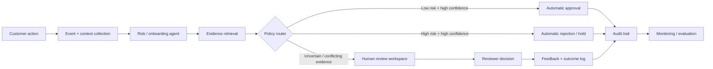

# Human–Agent Service Blueprint

A reference interaction model for high-stakes AI-assisted financial decisions.

## Design principles

1. **Progressive autonomy** — agents act independently only inside explicit confidence/risk boundaries.
2. **Evidence before explanation** — every recommendation references concrete evidence IDs rather than free-form persuasion.
3. **Human override is first-class** — reviewer decisions and notes are stored separately from the model recommendation.
4. **Uncertainty is visible** — ambiguous cases are routed to review instead of forcing a binary answer.
5. **Auditability** — inputs, evidence, model recommendation, human decision and final outcome can be reconstructed.
6. **Feedback without blind self-training** — reviewer disagreement becomes evaluation data before becoming training data.

## Prototype screens

### Customer / onboarding view
- checklist of required steps
- explicit “why we need this” explanations
- status and expected next action
- human escalation path

### Reviewer cockpit
- case summary
- risk score + confidence
- top evidence with source links
- agent rationale
- conflicting signals
- approve / reject / request information actions
- structured reviewer note

### Operations dashboard
- automation rate
- human review rate
- override rate
- false-positive / false-negative proxies
- time-to-decision
- queue age
- customer drop-off by workflow step

## Questions this design is meant to surface

- At what confidence should an agent be allowed to act without review?
- When is a human reviewer adding value versus merely rubber-stamping the model?
- What information does the human need to disagree safely?
- Which explanations improve decisions, and which only increase automation bias?
- How do we measure customer friction alongside model performance?
